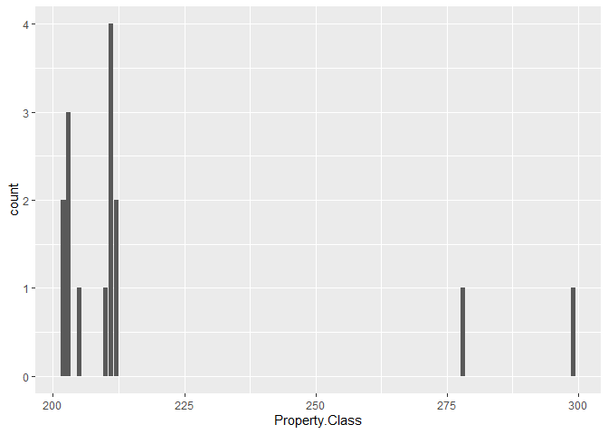

Heat Related Mortality in Cook County, IL
================
Arfa Aijazi
11/10/2020

## Data Source

### Epidemiological Data

This data comes from the Cook County Medical Examiner Case Archive and
contains information about all deaths that occurred in Cook County under
the Medical Examiner’s jurisdiction. The data available on the county’s
open data platform spans from August 2014-Present.

I spoke with the Medical Examiner’s Office Librarian regarding accessing
older regards. Records older than 2014 are not digitized i.e. paper
records. In order to access them, I can write a letter to the Chief
Medical Examiner describing who I am, the research project, and the
information needed.

Data from 1995 Chicago Heat Wave is documented in a graphic in this
article from Chicago Magazine
(<https://www.chicagomag.com/Chicago-Magazine/July-2015/1995-Chicago-heat-wave/>).
I have contacted the author and Chicago Magazine regarding the data
behind the graphic, but no response. As a last resort, I could manually
enter the date, address, and demographic information into a table to
join with other data sets.

Each record in the microdata represents an individual death and contains
the date and time of death, incident address, primary and secondary
causes of death, and demographic information about the deceased such as
age, gender, and race. Most relevant for this study, the Medical
Examiner’s office classifies whether the death was heat or cold related.

A significant limitation of this data set is that heat and subsequently
cold-related deaths are generally under-reported. Coroner’s often only
mark a death as heat-related when no other cause of death is suspected,
but that can miss cases in which heat or cold contributed to death from
another cause. Another limitation is that not all deaths in Cook County
are reported to or fall under the jurisdiction of the Medical Examiner’s
office.

## Data Import

Download libraries

``` r
library("tidyverse")
```

    ## -- Attaching packages -------------------------------------------- tidyverse 1.3.0 --

    ## v ggplot2 3.3.2     v purrr   0.3.4
    ## v tibble  3.0.3     v dplyr   1.0.2
    ## v tidyr   1.1.2     v stringr 1.4.0
    ## v readr   1.3.1     v forcats 0.5.0

    ## -- Conflicts ----------------------------------------------- tidyverse_conflicts() --
    ## x dplyr::filter() masks stats::filter()
    ## x dplyr::lag()    masks stats::lag()

``` r
library("lubridate")
```

    ## 
    ## Attaching package: 'lubridate'

    ## The following objects are masked from 'package:base':
    ## 
    ##     date, intersect, setdiff, union

``` r
library("tidygeocoder")
library("ggmap")
```

    ## Google's Terms of Service: https://cloud.google.com/maps-platform/terms/.

    ## Please cite ggmap if you use it! See citation("ggmap") for details.

    ## 
    ## Attaching package: 'ggmap'

    ## The following object is masked from 'package:tidygeocoder':
    ## 
    ##     geocode

Download Cook County Medical Examiner Case Archive Data

``` r
medExaminerData <- read_csv("https://datacatalog.cookcountyil.gov/api/views/cjeq-bs86/rows.csv?accessType=DOWNLOAD")

# Replace space character in column names with .
names(medExaminerData) <- str_replace_all(names(medExaminerData), " ", ".") 
```

Clean Cook County Medical Examiner Case Archive Data by filtering for
heat related deaths, removing suicides, and reclassifying race

``` r
medExaminerData_clean <- medExaminerData %>%
  mutate(Date.of.Incident = mdy_hms(Date.of.Incident)) %>%
  mutate(Date.of.Death = mdy_hms(Date.of.Death)) %>%
  filter(Heat.Related == TRUE) %>%
  filter(Manner.of.Death != "SUICIDE") %>%
  mutate(Race2 = case_when(Latino == TRUE ~ "Latino",
                           Latino == FALSE ~ Race))
```

Download Cook County Assessor’s Residential Property Characteristics

``` r
resPropChar <- read_csv("https://datacatalog.cookcountyil.gov/api/views/bcnq-qi2z/rows.csv?accessType=DOWNLOAD")

# Replace space character in column names with .
names(resPropChar) <- str_replace_all(names(resPropChar), " ", ".") 
```

Join medical examiner data with property characteristics by PIN.
Manually identified property PIN for each filtered observation in the
medical examiner data from the Cook County Assessor’s office website in
order to join both data sets. Joining by address was unsuccessful due to
variation in case, abbreviation, and spelling. Joining by longitude and
latitude was unsuccessful due to variation in geocoding.

``` r
heatPropertyKey <- read_csv("heatProperty.csv")

heatPropertyKey <- heatPropertyKey %>%
  mutate(PIN = str_replace_all(PIN, "-", ""))

medExaminerData_clean <- medExaminerData_clean %>%
  inner_join(heatPropertyKey, by = "Incident.Address") %>%
  inner_join(resPropChar, by = "PIN")
```

## Preliminary Analysis

### Date

Of the 15 cases, they are roughly evenly distributed between 2015-2020.
The cases spanned April-August, which represents spring and summer
seasons in Chicago. Over half of the cases ocurred in July.

    ## # A tibble: 5 x 2
    ##   Year.of.Incident     n
    ##              <dbl> <int>
    ## 1             2015     2
    ## 2             2016     3
    ## 3             2018     3
    ## 4             2019     4
    ## 5             2020     3

<!-- -->

    ## # A tibble: 5 x 2
    ##   Month.of.Incident     n
    ##               <dbl> <int>
    ## 1                 4     1
    ## 2                 5     1
    ## 3                 6     3
    ## 4                 7     8
    ## 5                 8     2

<!-- -->

### Demographics

Of the 15 cases, they are skewed towards an elderly population. Over the
half are over the age of 65. 80% of the cases are female and nearly half
are black.

    ## # A tibble: 14 x 2
    ##    Age.x     n
    ##    <dbl> <int>
    ##  1    18     2
    ##  2    36     1
    ##  3    47     1
    ##  4    56     1
    ##  5    61     1
    ##  6    63     1
    ##  7    70     1
    ##  8    71     1
    ##  9    76     1
    ## 10    81     1
    ## 11    83     1
    ## 12    87     1
    ## 13    90     1
    ## 14    95     1

Histogram bin width = 10 years
<!-- -->
Sorted in medically relevant age groups
(<https://www.ncbi.nlm.nih.gov/pmc/articles/PMC3825015/>)

    ## # A tibble: 4 x 2
    ##   Age.Categorical     n
    ##   <fct>           <int>
    ## 1 18-43               3
    ## 2 44-64               4
    ## 3 65-79               3
    ## 4 80+                 5

<!-- -->

    ## # A tibble: 2 x 2
    ##   Gender     n
    ##   <chr>  <int>
    ## 1 Female    12
    ## 2 Male       3

<!-- -->

    ## # A tibble: 4 x 2
    ##   Race2      n
    ##   <chr>  <int>
    ## 1 Asian      1
    ## 2 Black      7
    ## 3 Latino     3
    ## 4 White      4

<!-- -->

### Cause

The Medical Examiner’s data does not use a disease classification system
to label cause of death. After grouping related labels, a little over
the half of the deaths were due to a heart condition (cardiovascular
disease) and most of the remaining deaths were due to hyperthermia/heat
exposure. There is one death labeled as due to ethanol and amphetamine
toxicity (alcohol poisening). It may be reasonable to exclude this case
from our analysis.

    ## # A tibble: 10 x 2
    ##    Primary.Cause                                               n
    ##    <chr>                                                   <int>
    ##  1 COMPLICATIONS OF HYPERTHERMIA                               1
    ##  2 ENVIRONMENTAL HEAT EXPOSURE                                 2
    ##  3 ETHANOL AND AMPHETAMINE TOXICITY                            1
    ##  4 HEAT STROKE                                                 2
    ##  5 HYPERTENSIVE-ARTERIOSCLEROTIC CARDIOVASCULAR DISEASE        1
    ##  6 HYPERTENSIVE AND ATHEROSCLEROTIC CARDIOVASCULAR DISEASE     1
    ##  7 HYPERTENSIVE ARTERIOSCLEROTIC CARDIOVASCULAR DISEASE        1
    ##  8 HYPERTENSIVE CARDIOVASCULAR DISEASE                         3
    ##  9 HYPERTHERMIA                                                1
    ## 10 ORGANIC CARDIOVASCULAR DISEASE                              2

Group hyperthermia, heat stroke, and heat exposure -\> \_Hyperthermia
Group various labels for cardiovascular disease -\> Cardiovascular
Disease

    ## # A tibble: 3 x 2
    ##   Primary.Cause2                       n
    ##   <chr>                            <int>
    ## 1 Cardiovascular Disease               8
    ## 2 ETHANOL AND AMPHETAMINE TOXICITY     1
    ## 3 Hyperthermia                         6

<!-- -->

### Property Class

Designations by Cook County Assessor:
<https://prodassets.cookcountyassessor.com/s3fs-public/form_documents/classcode.pdf>

The top property types represented are apartment buildings, one story
residences 1000-1800 sf, one story residences \< 999 sf, and mixed use
commercial/residential

    ## # A tibble: 8 x 2
    ##   Property.Class     n
    ##            <dbl> <int>
    ## 1            202     2
    ## 2            203     3
    ## 3            205     1
    ## 4            210     1
    ## 5            211     4
    ## 6            212     2
    ## 7            278     1
    ## 8            299     1

<!-- -->

### Type of Residence

This parameter describes the number of stories

    ## # A tibble: 4 x 2
    ##   Type.of.Residence     n
    ##               <dbl> <int>
    ## 1                 1     5
    ## 2                 2     8
    ## 3                 3     1
    ## 4                NA     1

### Apartments

    ## # A tibble: 5 x 2
    ##   Apartments     n
    ##        <dbl> <int>
    ## 1          0     8
    ## 2          2     2
    ## 3          3     2
    ## 4          4     2
    ## 5         NA     1

### Central-Air

Note: the Assessor’s Office only considers central-air, buildings may
contain window air conditioner. Over 75% of the cases were in residences
without central air conditioning.

    ## # A tibble: 3 x 2
    ##   Central.Air2       n
    ##   <chr>          <int>
    ## 1 Central Air        3
    ## 2 No Central Air    11
    ## 3 <NA>               1

### Building Size

    ## # A tibble: 14 x 2
    ##    Building.Square.Feet     n
    ##                   <dbl> <int>
    ##  1                  924     1
    ##  2                  969     1
    ##  3                 1032     1
    ##  4                 1170     1
    ##  5                 1243     1
    ##  6                 1400     1
    ##  7                 1576     1
    ##  8                 1790     1
    ##  9                 1880     1
    ## 10                 2240     1
    ## 11                 3600     1
    ## 12                 3750     2
    ## 13                 4401     1
    ## 14                   NA     1

Histogram bin-width = 250 sf  
<!-- -->
\#\#\# Building Age Note: This field is a combination of original age
and effective age where original age refers to the oldest component of
the building and effective age is a relative judgment due to renovations
or other improvements. for instance, if a property is completely
demolished and built up again, the age resets to 1. But if portions of
the original structure are kept, it may be more complicated to determine
the age.

The median home age is 89 years and the cases are roughly normally
distributed.

    ## # A tibble: 13 x 2
    ##    Age.y     n
    ##    <dbl> <int>
    ##  1    34     1
    ##  2    47     1
    ##  3    55     1
    ##  4    56     2
    ##  5    70     1
    ##  6    86     1
    ##  7    89     1
    ##  8    93     2
    ##  9    99     1
    ## 10   101     1
    ## 11   102     1
    ## 12   107     1
    ## 13   140     1

``` r
median(medExaminerData_clean$Age.y)
```

    ## [1] 89

Histogram bin-width = 10 years  
<!-- -->
\#\#\# Wall Material

    ## # A tibble: 4 x 2
    ##   Wall.Material2     n
    ##   <chr>          <int>
    ## 1 Masonry           11
    ## 2 Wood               2
    ## 3 Wood & Masonry     1
    ## 4 <NA>               1
